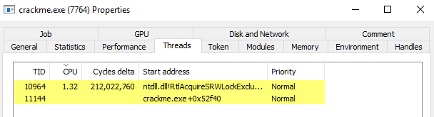

# tuts4you Users Desktop crackme Writeup

Source: https://forum.tuts4you.com/topic/43809-users-desktop-crackme/

The password which solves this challenge is the same as the one posted by kao.

Here is my quick writeup for the same.

## I : Bypassing anti-debug
First of all, to make the addresses not vary in between runs we can disable ASLR for this binary by patching changing the Dll can move flag in the Optional header. This is not strictly required but makes it easy to follow along.

The binary implements lots of anti-debug, specially playing with HANDLES which makes it a little bit tough to debug right out of the box. Also trying to the attach to the application would make it quit immediately. 

In Process Hacker  we can check that the application is multi-threaded. 


In fact the protection logic is implemented on the secondary thread which has a higher cpu usage (1.32 in the picture). At this point we can suspend the thread. Once that is done we can simply attach to the process with x64dbg without any issue.

## II : Finding a suitable point to start

We are already attached to the crackme process. At this point it is still waiting for our input on the main thread. We need to find a suitable place to set a breakpoint on such that we can trace the password checking logic with minimal overhead.

A nice place to set a breakpoint is in `kernelbase.dll!ReadFile` just after the call to `NtReadFile` as shown.


With the breakpoint in place we can enter any password say `123456789ABCDEF` and hit enter. The breakpoints immediately hits.


From here we can continue single stepping until we exit the `fgets` function and enter the VM region identified by the presence of obfuscated code.


The `ret` instruction at `0x140004B51` should likely be the end of the `fgets` function. 

Stepping once from here we can see obfuscated code signifying the start of VM.


## III - Tracing the VM

At this point on the stack we can see our entered password.


We can set a hardware breakpoint on read at `0x14FD68`, the address where the password is stored in memory and continue running the crackme.

When the breakpoints hits, set another standard breakpoint on `MessageBoxW` function. The crackme displays the success or failure using this API.

Now using x64dbg "Run trace" we can log all instructions until it hits `MessageBoxW`. This will take quite some time. Make sure to set a large enough value for "Maximum Trace Count" as shown.


## IV - Filtering the trace

When the breakpoint at `MessageBoxW` hits we can stop tracing and export the trace log to a csv. The objective is to remove all non xor instructions from the trace. Also other xor instructions like `xor eax, eax`, `xor ebx, ebx` which are irrelevant towards our goal can be removed. This can be accomplished using a decent text editor like Notepad++.

After removing all irrelevant instructions, we are left with just two xor instructions.
```csv
07B77,000000014004602B,33C3,"xor eax,ebx",rax: B3-> 43,,"ebx:&""C:\\crackme.exe"""
448EB,000000014004602B,33C3,"xor eax,ebx",rax: 36-> 0,,"ebx:&""C:\\crackme.exe"""
```

After the first xor, eax holds 0x43 = 'C' which is the first character of our password.
The second xor is comparing the null terminator.

There are no more xor's as the crackme stops comparing further characters as soon as a mismatch is found.

## V - Recovering the password 

We can set a breakpoint on the instruction `xor eax, ebx` at `0x1400046020`. The value in `eax` after the xor is the correct character corresponding password character.


Here `eax` = 0x43 = 'C' which is the first character of the password.


To get other characters of the password we cannot resume yet. Note that the application exits as soon as a mismatch is found. Hence we can overwrite the value in eax to 0x31 = '1'  instead which is the first character of our entered password (`123456789ABCDEF`).

We can automate these steps using a Frida script.

```js
var password = []

Interceptor.attach(ptr(0x14004602B), function (args) {
	console.log("Breakpoint===");
	const r_rax = this.context.rax.toInt32();
	const r_rbx = this.context.rbx.toInt32();

	if (r_rax < 0xff && r_rbx < 0xff) {
		const password_char = r_rax ^ r_rbx;
		if (password_char == 0) {
			console.log(String.fromCharCode(...password));
		} else {
			password.push(password_char);
		}
		this.context.rax = ptr(0x31);
		this.context.rbx = ptr(0x0);
	}
});
```

The script sets a interceptor at the instruction at `0x14004602B` => `xor eax, ebx` .
When using the script we have to input a large string of 1's (like 1111111111111111111111111111111111) as the password. The script will overwrite the registers such that after the xor rax contains 1, making the crackme believe the check succeeded.

Finally, we print the complete password when we have got the null terminator.


The correct password is printed at the end. Note that we need to inject the frida script after suspending the protection thread in the same way we were attaching the debugger.